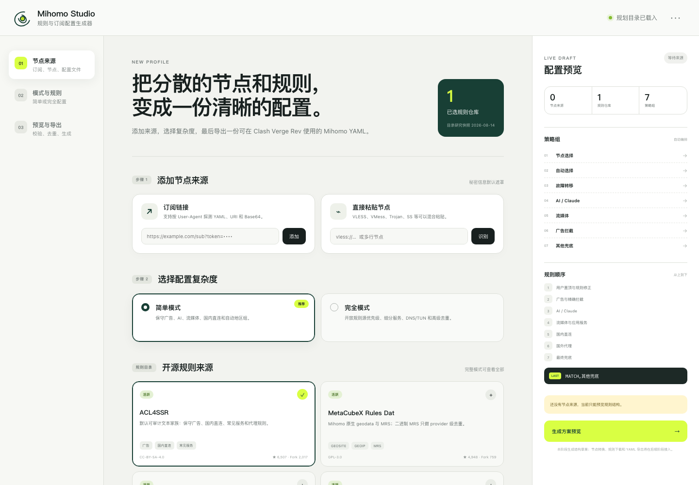

# Mihomo Studio

跨平台 Mihomo 订阅、规则和策略组配置生成器。目标是让用户把订阅链接、直接节点和开源规则源整合成一份可在 Clash Verge Rev 中使用的完整 YAML，而不是再做一个代理客户端。

> 当前状态：Phase 2 进行中。Tauri 2 工程、规则目录、订阅安全抓取、Mihomo YAML 与 VLESS URI/Base64 URI Node IR、严格 Rule/Provider IR、确定性隐私 YAML 和静态回读已经接通；其他协议/provider resolver、应用内 Mihomo sidecar 与原子文件导出仍按实施计划推进。



## 技术栈

- Tauri 2
- Rust 2021
- React 19 + TypeScript
- Vite 7
- Vitest

## 已经实现

- 简单模式 / 完全模式切换；
- 订阅链接和直接节点的本地输入界面；
- Rust 后端按 `Mihomo → Clash.Meta → Clash Verge → Browser` 顺序探测订阅；
- 系统代理/直连抓取路径、20 秒超时、5 次重定向和 8 MiB 响应上限；
- 订阅 URL 只在当前 IPC/请求内存中使用，返回 UI 的标签不含 path/query/fragment；
- URI、Base64 URI、Mihomo `proxies` YAML 和 `proxy-providers` YAML 内容识别；
- 节点名称无关的 SHA-256 精确指纹与来源内去重；
- 结构化开源规则源 catalog；
- GitHub 镜像配置；
- 基础策略组和唯一最终 `MATCH,其他兜底` 预览；
- Rust catalog 校验和 draft 编译命令；
- IPv4 literal Mihomo YAML、VLESS URI 与 Base64 VLESS 节点的跨来源去重与严格 Node IR；
- 已识别/格式可编译/严格生成三层状态与主操作附近的进度、失败反馈；
- `DIRECT` → `节点选择` 的显式严格策略、代理下载 rule provider 和唯一最终 `MATCH`；
- `fake-ip`、代理绑定 DoH、DNS hijack、TUN strict route、IPv6 关闭的确定性 YAML；
- IR 引用/组图检查、YAML 回读、脱敏 golden test 与无秘密生成报告；
- Tauri 中默认折叠展示并复制生成 YAML；
- Rust 后端采用 DDD + Hexagonal Architecture 的四层依赖结构；
- React 前端采用 `app / features / shared` 功能切片；
- 前端与 Rust 单元测试；
- 不包含 DivineEngine 代码、规则或远程依赖。

## 开发

```bash
npm install
npm run check:spec
npm run test:mihomo-fixture
npm run dev
npm test
npm run build
npm run tauri dev
```

Rust 验证：

```bash
cd src-tauri
cargo fmt --check
cargo test
cargo check
```

`npm run test:mihomo-fixture` 当前只在 Apple Silicon macOS 上下载固定 SHA-256 的官方 Mihomo v1.19.29，并用临时 HomeDir 加载脱敏 golden YAML；它不是应用内 sidecar 或实际网络出口验证。

## 目录

```text
src/app/                          React composition 与页面级编排
src/features/                     来源、规则构建、预览功能切片
src/shared/                       IPC adapter、contracts 与共享 UI
src/data/                         规则源目录
src-tauri/src/domain/             bounded contexts 与领域不变量
src-tauri/src/application/        用例、ports 与依赖容器
src-tauri/src/infrastructure/     HTTP、embedded catalog 等 adapters
src-tauri/src/interface/ipc/      Tauri inbound adapter
src-tauri/src/lib.rs              Composition root
openspec/                         当前能力 Specs、changes 与 roadmap
scripts/                          Spec/架构漂移门禁
docs/                             产品研究、决策背景与阶段快照
```

## 事实边界

- “结构预览成功”不等于 YAML 已生成；serializer 与静态回读成功后才显示“YAML 已生成”；
- “Mihomo 静态验证通过”不等于 Clash Verge 已加载；
- “Clash Verge 已加载”不等于规则命中和最终出口已经验证；
- 后续实现会分别报告这些状态。

## 文档

- [OpenSpec 项目入口](openspec/project.md)
- [能力索引](openspec/spec-index.json)
- [跨能力路线图](openspec/roadmap.md)
- [文档地图](docs/README.md)
- [产品规划](docs/PRODUCT_PLAN.md)
- [UI 交互](docs/UX_FLOW.md)
- [早期目标架构](docs/ARCHITECTURE.md)
- [规则源与去重](docs/RULE_SOURCES_AND_DEDUP.md)
- [开源规则生态调研](docs/RULE_ECOSYSTEM_RESEARCH.md)
- [NAS 参考实现审计](docs/NAS_REFERENCE_AUDIT.md)
- [实施计划](docs/IMPLEMENTATION_PLAN.md)
- [当前实施状态](docs/IMPLEMENTATION_STATUS.md)
- [节点来源接入](docs/SOURCE_INGESTION.md)
- [产品与架构决策](docs/DECISIONS.md)
